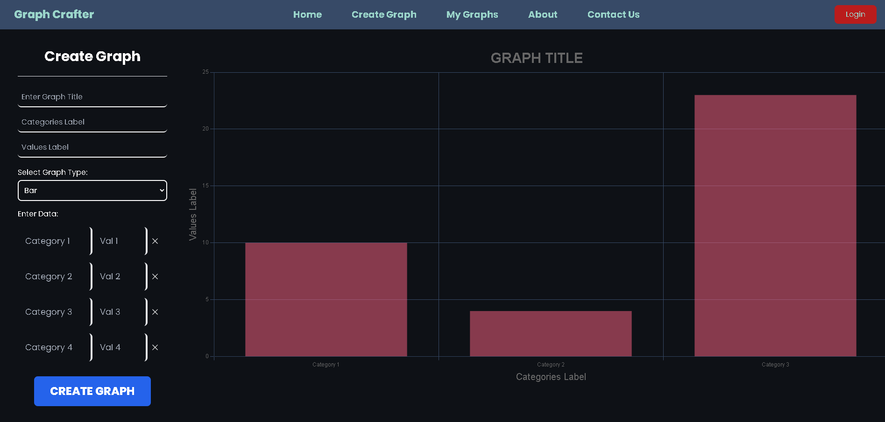

# OVERVIEW

Graph Crafter offers a method to quickly visualize data with an easy-to-use interface

It can currently render bar graphs, but different graph types, such as pie graphs, are planned to be implemented

## MAIN FUNCTIONAlITIES

### Building a graph

- The user can navigate to the "Create Graph" page provided by the navbar

- A sample graph is then displayed, users can use this sample graph to understand where the labels are placed

- Under the "Create Graph" section of the page, users must enter the following to produce a valid graph

    - Graph Title, label for the different categories, label for the values measuring the categories. Examples for this include "Bears in the Wild" for the title, "Bear Type" for categories, and "Amount of Bears" for the values label.

    - Data entries for the categories and their corresponding values. For instance, in a graph called "Bears in the Wild," one may delegate of a value of 5 to the "Polar" category, indicating that there are 5 polar bears in the wild.

- After the data is entered, the user can select the blue "CREATE GRAPH" button at the bottom to visualize their data

- The graph is then displayed and automatically saved

### Retrieving or deleting a saved graph

- The user can navigate to the "My Graphs" section through the navbar

- Upon entering, if graphs have been created, the saved graph files will appear on the right

- The user can then click the file icon to load the graph, or the trash icon to delete the graph

### Contact the developer

- The user can navigate to the "Contact Us" page

- They are then greeted with a form that contains the fields "Name", "Email", and "Message"

- All of these fields are to be filled out to constitute a valid message

- Upon filling the fields, users can then "Submit" to send their message to the development team

---

### TECH STACK

- React frontend
- Tailwind CSS
- Java Spring backends
- Kubernetes for deployment
- Sendgrid API for sending emails
- Charts.js for graph appearance
- Docker for containerization
- Helm for managing deployments in Kubernetes
- Observability platform including the following:
    - Prometheus
    - Grafana
    - ElasticSearch
    - FluentBit

### TO RUN THE PROJECT

Install the following:

- Docker
- Kind (Kubernetes)
- Helm
- Sengrid and ElasticSearch environment variables

Include the env variables:

- ElasticSearch and Sengrid secretes in the graphcrafter helm chart under the Kubernetes directory
- Create a .env file in the "contact-us service" root directory and include the API key in it

Then:

- Enter "notepad C:\Windows\System32\drivers\etc\hosts" into an administrator command line
- Add the following entries "127.0.0.1 graphcrafter.com" and "127.0.0.1 metrics.graphcrafter.com"

And then:

- Start docker desktop
- In a powershell terminal execute "kind create cluster"
- Once cluster is created, execute "helm install graphcrafter ." inside of the Kubernetes directory in the project
- Then, execute "helm install ingress-nginx ingress-nginx/ingress-nginx" 
- Once the ingress is installed and running, conduct a port forward with the command "kubectl port-forward service/ingress-nginx-controller 3333:80" and keep the terminal window open
- Access the app at [http://graphcrafter.com:3333](http://graphcrafter.com:3333)

If you want to access the observability platform:

- In addition to the above steps, perform "helm install fluent-bit ./fluent-bit" and "helm install grafana ./grafana" while in the Kubernetes directory 
- Navigate to [http://metrics.graphcrafter.com:3333](http://metrics.graphcrafter.com:3333) and login with the credentials "admin" and "admin"
- Change the password if you desire
- Navigate to the dashboard section on the left and select the "Contact Us Service" dashboard
